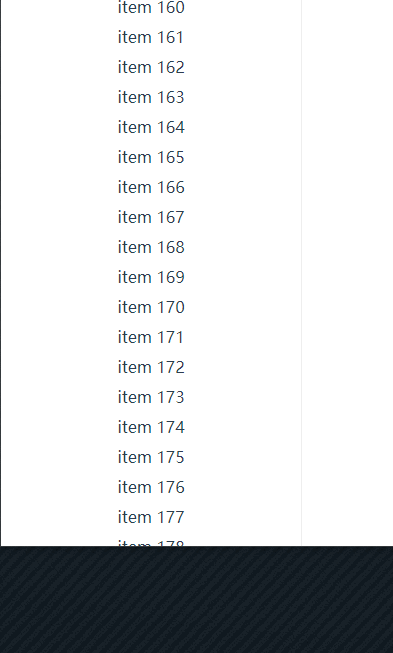
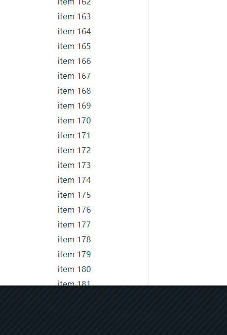

# element-bug-scrollbar
外层包裹元素尺寸变化后，滑动轨道与期待不符

## 重现步骤
将指令注释可重现bug，添加指令可查看解决方案的效果

npm i & npm run serve

将滚动条滑倒底部,缩放浏览器

放大 el-scrollbar 元素的高度会导致滑块无法滚动到底部

缩小 el-scrollbar 元素的高度会导致滑块滑倒底部时部分不可见



## 解决方案
``` js
var wrap = document.querySelector('.el-scrollbar__wrap')
var thumb = document.querySelector('.el-scrollbar__thumb')
var percent = wrap.scrollTop / wrap.offsetHeight * 100 + '%'
// 通过 `translateY(${percent})` 来控制滑块的位置，但是缩放 wrap 并不会改变滑块的高度，所以才会导致该bug
// 解决办法也很简单，监听 wrap 的尺寸变化，获得 wrap 高度改变的比例，同比放大滑块高度并重新计算 transform 位置即可。横向滚动条同理
this.resize(wrap, (val, oldVal) => {
  var height = val.height
  var oldHeight = oldVal.height
  thumb.style.height = height / oldHeight * parseFloat(thumb.style.height) + '%'
  thumb.style.transform = `translateY(${wrap.scrollTop / wrap.offsetHeight * 100}%)`
})
```


